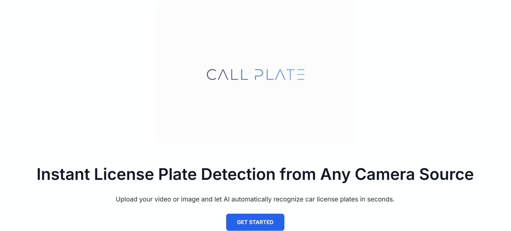
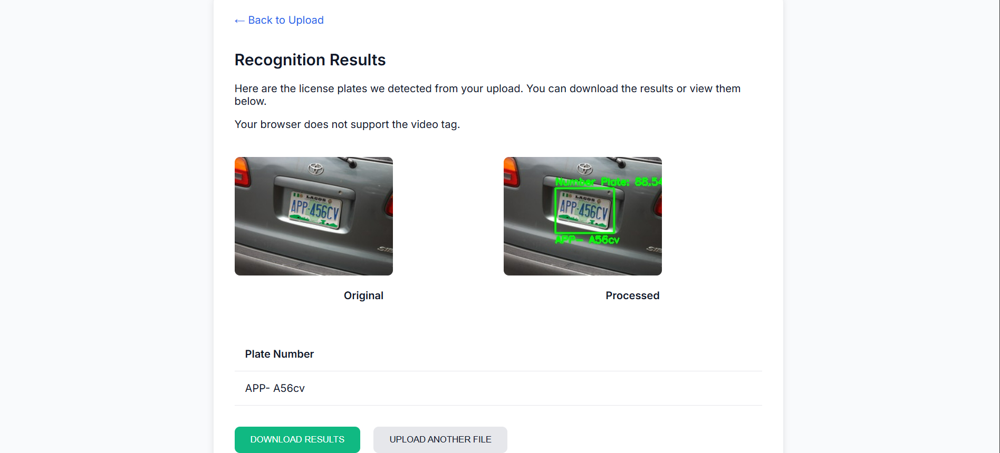
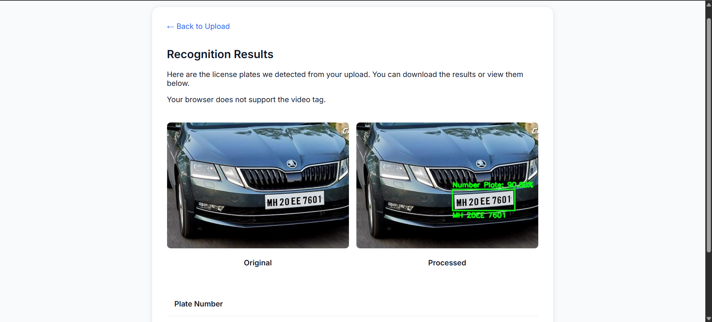

# 🚗 Call Plate – AI-Powered License Plate Recognition

Call Plate is a full-stack web application that uses **YOLOv8** and **EasyOCR** to automatically detect and read car license plates from both images and videos. The app is designed for real-time surveillance, parking automation, and intelligent traffic systems.

## 🔍 Features

- ✅ **YOLOv8** for accurate license plate detection
- 🔠 **EasyOCR** for text extraction from plates
- 🖼️ Supports **image** and **video** uploads
- 📥 Download results in **CSV**, **text**, or **image** format
- 🧠 Real-time processing and interactive result display
- 🌐 Responsive UI using HTML, CSS, and JavaScript
- 🧪 Flask backend with seamless model integration

## 🛠️ Tech Stack

| Layer       | Technologies Used |
|-------------|-------------------|
| Frontend    | HTML, CSS, JavaScript |
| Backend     | Python, Flask |
| AI Models   | YOLOv8 (for detection), EasyOCR (for recognition) |
| Libraries   | OpenCV, NumPy, Flask, YOLO, EasyOCR |

## 📸 Screenshots

### 🏁 Homepage – Branding & Entry Point  
Welcome screen with logo and CTA button to start plate detection.  


---

### 📤 Upload Page – Media Submission Interface  
Upload your image/video, select options, and begin detection.  


---

### 📊 Results Page – Plate Recognition Output  
Displays the original and processed image/video side-by-side.  
Recognized license plates are extracted and shown in a table.  
  



## 🚀 Getting Started

### Prerequisites

- Python 3.8+
- pip

### Installation

```bash
git clone https://github.com/AhmedMoatasem01/Call-Plate.git
cd Call-Plate
pip install -r requirements.txt
```
Run the Application
```bash

python app.py
```

Then open your browser and go to:
```bash

http://127.0.0.1:5000/
```

📂 Folder Structure
Call-Plate/
│
├── static/              # CSS, JS, and assets
├── templates/           # HTML templates (home, upload, results)
├── uploads/             # Uploaded media (images/videos)
├── outputs/             # Processed result files
├── models/              # YOLOv8 and OCR models (if local)
├── app.py               # Main Flask application
├── detect.py            # Plate detection logic
├── ocr.py               # OCR and result parsing logic
└── requirements.txt     # Python dependencies

🧪 Example Use Cases : 

 Smart city surveillance
  
Parking garage management

Border control plate scanning

Automated toll booth systems

📄 License
This project is open-source and available under the MIT License.

👨‍💻 Author

Ahmed Moatasem Momtaz

📍 Cairo, Egypt

📧 ahmedmoatasem11@gmail.com


